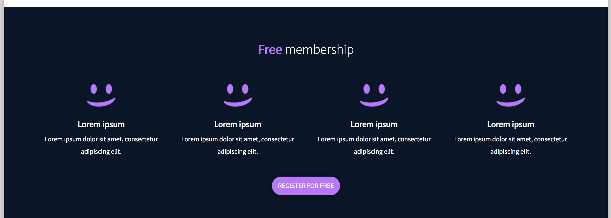
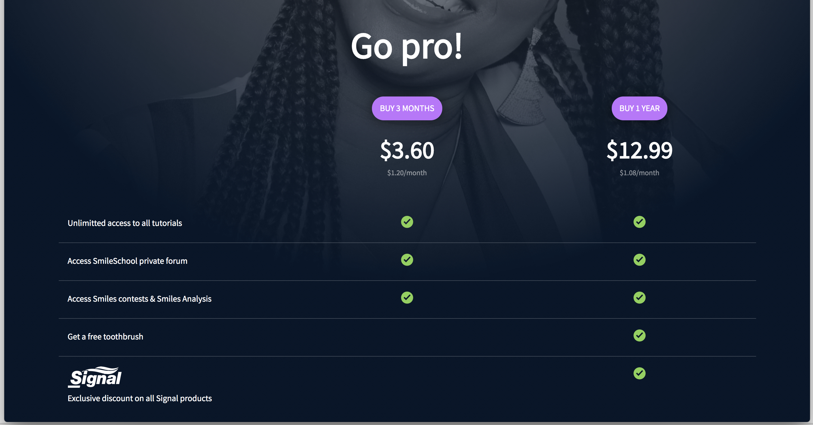

# Learning Objectives

> - In this project, you will implement 3 web pages with Bootstrap. You will use all HTML/CSS/Accessibility/Responsive design/Bootstrap knowledges that you learned previously.
> - You won’t have a lot of instruction, you are free to implement it the way that you want - the objective is simple: Have fully functional web pages that look the same as the designer file.

Here the final result:

# Wireframe of the Smiling-School project - desktop version (1440px)

# Wireframe of the Smiling-School project - desktop version (1440px)

# Wireframe of the Smiling-School project - desktop version (1440px)

# Wireframe of the Smiling-School project - tablet version (768px)

# Wireframe of the Smiling-School project - tablet version (768px)

# Wireframe of the Smiling-School project - tablet version (768px)

# Wireframe of the Smiling-School project - mobile version (576px)

# Wireframe of the Smiling-School project - mobile version (576px)

# Wireframe of the Smiling-School project - mobile version (576px)

# Requirements

> - You have to use Bootstrap
> - Your styles.css must be as small as you can - you must use as much as you can Bootstrap classes

# Tasks

**0. Read and be familiar with Figma**
File: [README.md](README.md/)
File: [figma](https://www.figma.com/files/recent/)

**1. Header first**
File: [0-homepage.html](0-homepage.html/)
File: [styles.css](styles.css/)

## Final rendering

**2. Carousel of quotes**
File: [1-homepage.html](1-homepage.html/)
File: [styles.css](styles.css/)

## Final rendering

**3. Popular videos**
File: [2-homepage.html](2-homepage.html/)
File: [styles.css](styles.css/)

## Final rendering

**4. Row of smiles**
File: [3-homepage.html](3-homepage.html/)
File: [styles.css](styles.css/)

## Final rendering

**5. Latest videos**
File: [4-homepage.html](4-homepage.html/)
File: [styles.css](styles.css/)

**6. ... and the footer!**
File: [homepage.html](homepage.html/)
File: [styles.css](styles.css/)

## Final rendering

**7. Pricing - header**
File: [0-pricing.html](0-pricing.html/)
File: [styles.css](styles.css/)

## Final rendering

**8. Prices grid**
File: [1-pricing.html](1-pricing.html/)
File: [styles.css](styles.css/)

## Final rendering

**9. Quotes section**
File: [2-pricing.html](2-pricing.html/)
File: [styles.css](styles.css/)

**10. FAQ**
File: [3-pricing.html](3-pricing.html/)
File: [styles.css](styles.css/)

## Final rendering

**11. Close the page with a footer**
File: [pricing.html](pricing.html/)
File: [styles.css](styles.css/)

**12. Courses - header**
File: [0-courses.html](0-courses.html/)
File: [styles.css](styles.css/)

## Final rendering

**13. Search filters**
File: [1-courses.html](1-courses.html/)
File: [styles.css](styles.css/)

## Final rendering

**14. List of result**
File: [2-courses.html](2-courses.html/)
File: [styles.css](styles.css/)

## Final rendering

**15. Close the page with a footer**
File: [courses.html](courses.html/)
File: [styles.css](styles.css/)

# Author

> Paula Sotelo Vandamme

> [E-mail](omeinsotelo@gmail.com)

> [Github](https://github.com/omeinsotelo)

> [Twiiter](https://twitter.com/omeinsotelo)

> [Linkedin](https://www.linkedin.com/in/paula-sotelo-ba733a70/)
